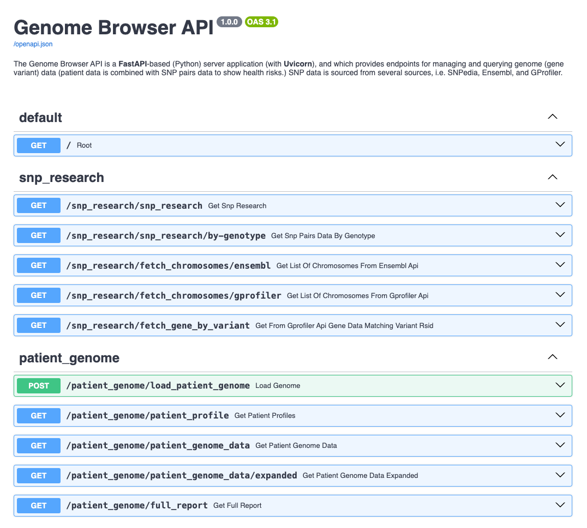

# Genome Browser API

## Overview

The Genome Browser API is a **FastAPI**-based (Python) server application (with **Uvicorn**), and which provides endpoints for managing and querying genome (gene variant) data (patient data is combined with SNP pairs data to show health risks.) SNP data is sourced from several sources, i.e. SNPedia, Ensembl, and GProfiler.

••Objectives\*\*:

1. Comparison of ancestry website DNA report with SNPedia data. The major/minor alleles of gene variants, their associated gene, chromosome position, etc..

2. This also serves to demonstrate:

- A _FastAPI_ implementation (with **Uvicorn**)
- The controller/services approach.
- **Pydantic** typing.
- **REST**ful and **WebSocket** connections for real-time, low-latency communication. Also, **Swagger** documentation.
- Consideration of DRY/SOLID principles, and Gang of Four design patterns
- **SQLite3Worker**: This library implements a **thread pool pattern** with **sqlite3** being the desired output. The library creates a queue to manage multiple queries sent to the database. (sqllite3 implementation lacks the ability to safely modify the sqlite3 database with multiple threads outside of the compile time options.) Instead of directly calling the sqlite3 interface, the Sqlite3Worker is called, and it inserts the query into a **Queue**.Queue() object. The queries are processed in the order that they are inserted into the queue (first in, first out). In order to ensure that the multiple threads are managed in the same queue, you will need to pass the same Sqlite3Worker object to each thread.
- **VirtualEnv** Python environment, with **`.env`** files.

## Architecture

`python3 src/main.py` (effectively, unvicorn implementation within is: `python -m uvicorn main:app --reload`)

1. **Controllers**:

   - Handles the HTTP requests, processes input, and returns HTTP responses. It should call the service layer to perform business logic.
   - Created `controllers/genome_controller.py` and `controllers/websocket_controller.py` to handle the routing logic.
   - Moved route-specific logic from `routes.py` to the respective controllers.
   - Added detailed comments to the controllers to explain the purpose and functionality of each endpoint.

2. **Services**:

   - Contains the business logic of the application. It performs operations and calls the repository layer to interact with the database.
   - Created `services/genome_service.py` and `services/websocket_service.py` to handle the business logic.
   - Moved business logic from the controllers to the respective services.
   - This separation allows for better unit testing and adherence to the Single Responsibility Principle (SRP).

3. **Repositories**:

   - Handles direct interactions with the database. It performs CRUD operations and returns data to the service layer.
   - Created `repositories/genome_repository.py` to handle database interactions.
   - Moved database interaction logic from `genomedatabase.py` to the repository.
   - This follows the Repository Pattern, which abstracts the data access logic and provides a clean API for the domain layer.

4. **Models**:

   - Created `models.py` to define data models using **Pydantic**.
   - This ensures data validation and type checking, improving the robustness of the application.

5. **Routes**:

   - Defines the API endpoints and maps them to the appropriate controller functions.

### Design Patterns and Principles

1. **Single Responsibility Principle (SRP)**:

   - Each class and module has a single responsibility, making the code easier to understand and maintain.

2. **Repository Pattern**:

   - Abstracts the data access logic, providing a clean API for the domain layer and promoting separation of concerns.

3. **Domain-Driven Design (DDD)**:

   - Organises the codebase into domains, with clear boundaries between the application, domain, and infrastructure layers.

4. **Dependency Injection**:
   - Services and repositories are injected into controllers, promoting loose coupling and making the code more testable.

### Merits

- **Maintainability**: The separation of concerns makes the codebase easier to understand and maintain.
- **Scalability**: The modular design allows for easy addition of new features and scaling of the application.
- **Testability**: The clear separation of business logic, data access, and routing logic makes unit testing more straightforward.
- **Robustness**: Data validation using Pydantic models ensures that the data conforms to the expected schema.

### Drawbacks

- **Complexity**: The initial setup and understanding of the architecture may be more complex compared to a monolithic design.
- **Overhead**: The additional layers and abstractions may introduce some overhead, but this is often outweighed by the benefits in larger applications.

### Considerations

1. The family tree/ancestry websites (i.e. that provide DNA tests; based on saliva samples), do not always use the same lettering as SNPedia.
2. The family tree/ancestry websites do test for many, but not every gene variant.

## Endpoints



There are several options:

- **`patients/`**: Retrieves a list of the patients (that have been uploaded to the SQLite database.)
- **`snp_research/`**: Retrieves the SNP Pairs data (from published literature, i.e. SNPedia); the underlying method is called when the Uvicorn FastAPI server is launched.
- **`patient_profile/`**: Retrieves patient id, and patient name.
- **`patient_genome_data/`**: Retrieves patient genotypes (gene varients, and the associated two alleles).
- **`patient_genome_data_expanded/`**: Retrieves patient profile, and their genotypes, joined on `patient_id`.
- **`full_report/`**: Retrieves the `patient_genome_data_expanded`, and published literature (join on `rsid.`)

## Getting Started

### Installation Locally

1. Clone the repository:

   ```bash
   git clone https://github.com/mathematicuslucian/genome-browser-api.git
   cd genome-browser-api
   ```

2. Install the dependencies:

   ```bash
   pip install -r requirements.txt
   ```

   The `requirements.txt` file has dependencies to install (it was generated with the command `pipreqs src/  --force --ignore=tests`):

   - Python 3.8+
   - FastAPI
   - Uvicorn
   - Pydantic
   - SQLite3

   For the tests, the following depdendencies are required:

   - mock==5.1.0
   - pandas==2.2.3
   - pytest==8.3.4

3. Set up the environment variables:

   ```bash
   cp .env.example .env
   ```

4. Setup the Python Environment (VirtualEnv):

   - Create: `python -m venv genomebrowser`
   - Launch environment: `source genomebrowser/bin/activate`
   - Delete environment: `deactivate` and `rm -r venv`

### Dev: Run the FastAPI server locally

1. Run the application:
   ```bash
   uvicorn main:app --reload\
   ```
2. Load a Patient Genome:


- `/genome/load_patient/{genome_file_name_with_path}`
- If you provide the string `default` for `genome_file_name_with_path`, it will load the default patient data (`genome_Lilly_Mendel_v4.txt`.)

3. From your UI client app, or Postman, etc. call`http://127.0.0.1:8000/api`.

(The API documentation is available at `/docs` (Swagger UI) and `/redoc` (ReDoc), i.e. open a browser, and (for **Swagger**) open either `http://127.0.0.1:8000/docs`, or `http://127.0.0.1:8000/redoc`.)

## Testing Details

### Unit Tests

**Run Tests**:

1. Ensure `pytest` is installed in your environment.
2. Run the tests using the command: `pytest tests`

**Details**:

The `test` directory contains `pytest` test cases for the `GenomeBrowser` class methods, which include both positive and negative scenarios, as well as exception handling.

Fixtures:

- `genome_browser`: A pytest fixture to initialise the `GenomeBrowser` instance with mock data.
- Mocking the `patient_genome_df` attribute of the `GenomeBrowser` class to use mock data instead of actual data files.

Examples of the Test Cases:

1. `test_retrieve_data_by_column_positive`:
   - Positive case: valid column and key.
2. `test_retrieve_data_by_column_positive_another_key`:
   - Positive case: another valid column and key.
3. `test_retrieve_data_by_column_negative_column_not_found`:
   - Negative case: column not found.
4. `test_retrieve_data_by_column_negative_key_not_found`:
   - Negative case: key not found.
5. `test_retrieve_data_by_column_no_genome_data`:
   - Negative case: no genome data loaded.
6. `test_retrieve_data_by_column_invalid_column_type`:
   - Negative case: invalid column type.
7. `test_fetch_gene_variant_positive`:
   - Positive case: valid fetch_gene_variant.
8. `test_fetch_gene_variant_negative_key_not_found`:
   - Negative case: fetch_gene_variant key not found.
9. `test_fetch_gene_variant_invalid_key_type`:
   - Exception handling: invalid key type.

## Data Sources

### Published literature

**Published Genome**

`genome_Lilly_Mendel_v4.txt`

[SNPedia: Lily Mendel](https://www.snpedia.com/index.php/User:Lilly_Mendel)

**Chromosomes data from ensembl**:
[Source](https://grch37.rest.ensembl.org/documentation/info/assembly_info)
Chromosome 1
Chromosome 2
Chromosome 3
Chromosome 4
Chromosome 5
Chromosome 6
Chromosome 7
Chromosome 8
Chromosome 9
Chromosome 10
Chromosome 11
Chromosome 12
Chromosome 13
Chromosome 14
Chromosome 15
Chromosome 16
Chromosome 17
Chromosome 18
Chromosome 19
Chromosome 20
Chromosome 21
Chromosome 22
X Chromosome
Y Chromosome

**SNP Pairs Data**

The major/minor alleles of gene variants, their associated gene, chromosome position, etc..

`snp_data.csv`

_Columns:_ RSID, Magnitude, Risk, Notes

## No License Granted

No approval is granted for third-party usage.
